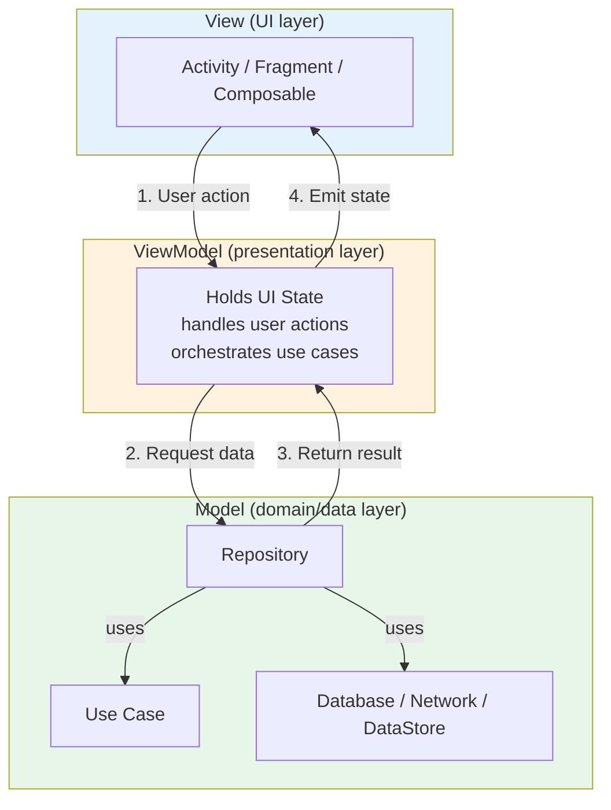
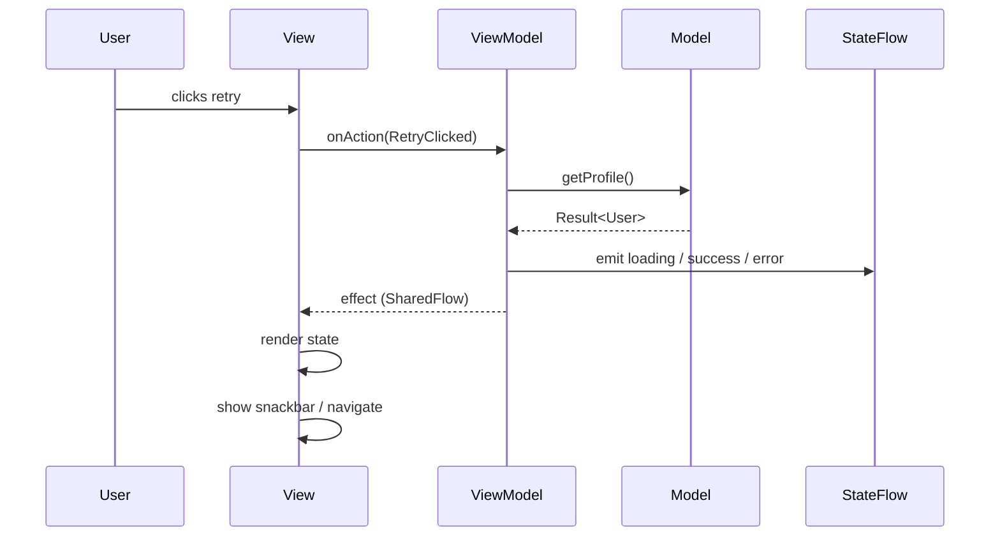
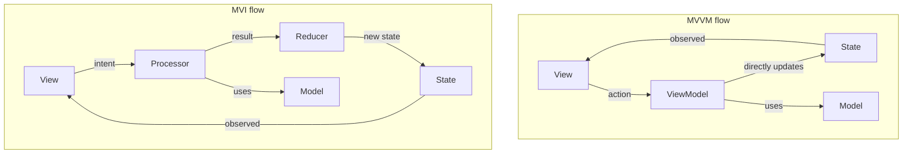

# MVVM

DAY 15-21: MVVM Pattern

Goal: Understand responsibility boundaries, not just class names.

## 1. MVVM Mental Model

MVVM splits screen code into three layers with a clear contract: the **View** observes **State** from the **ViewModel**, the **ViewModel** talks to the **Model**, and the **Model** returns data or results without knowing anything about the UI.



**View:**
- Activity, Fragment, or Composable.
- Renders state and forwards user actions.
- Should contain minimal business logic.
- Knows the ViewModel by interface/abstraction when possible.

**ViewModel:**
- Holds UI state.
- Handles UI events/actions.
- Calls use cases/repositories.
- Survives configuration changes.
- Never holds Android framework classes such as `Context`, `View`, or `NavController`.

**Model:**
- Domain/data layer objects and operations.
- Repository, use cases, database, network.
- Pure business logic lives here, not in the ViewModel.

## 2. State, Event, Effect

A strong ViewModel API separates three distinct concepts. State is the current screen snapshot, events are requests to change something, and effects are one-time instructions to the UI.



**State:**
- Persistent representation of the screen.
- Loading flag, data, error message, selected tab, etc.
- Use `StateFlow` so the UI always has a current value.

**Event / Action:**
- User input sent from UI to ViewModel.
- Search changed, retry clicked, item selected.
- Keeps the View thin and makes the ViewModel the single entry point for logic.

**Effect:**
- One-time instruction to the UI.
- Navigate, show snackbar, request permission, play a sound.
- Use `SharedFlow` with `replay = 0` or a `Channel` so the event is not replayed after configuration change.

````kotlin
data class ProfileState(
    val isLoading: Boolean = false,
    val user: User? = null,
    val error: String? = null
)

sealed class ProfileAction {
    object RetryClicked : ProfileAction()
    data class UserNameChanged(val value: String) : ProfileAction()
}

sealed class ProfileEffect {
    data class ShowSnackbar(val message: String) : ProfileEffect()
    data class NavigateToDetails(val userId: String) : ProfileEffect()
}

class ProfileViewModel(private val getProfile: GetProfileUseCase) : ViewModel() {
    private val _state = MutableStateFlow(ProfileState())
    val state: StateFlow<ProfileState> = _state.asStateFlow()

    private val _effects = MutableSharedFlow<ProfileEffect>()
    val effects: SharedFlow<ProfileEffect> = _effects.asSharedFlow()

    fun onAction(action: ProfileAction) {
        when (action) {
            ProfileAction.RetryClicked -> load()
            is ProfileAction.UserNameChanged -> updateName(action.value)
        }
    }

    private fun load() {
        viewModelScope.launch {
            _state.value = ProfileState(isLoading = true)
            getProfile().fold(
                onSuccess = { _state.value = ProfileState(user = it) },
                onFailure = {
                    _state.value = ProfileState(error = it.message)
                    _effects.emit(ProfileEffect.ShowSnackbar("Could not load profile"))
                }
            )
        }
    }

    private fun updateName(value: String) {
        _state.value = _state.value.copy(user = _state.value.user?.copy(name = value))
    }
}
````

## 3. View Should Be Thin

The View owns layout and lifecycle integration, not business decisions.

Good View responsibilities:
- Collect state with lifecycle awareness (`collectAsStateWithLifecycle()`).
- Render based on state.
- Forward clicks/text changes/actions to the ViewModel.
- Collect effects and perform UI-only operations.

Bad View responsibilities:
- Calling API directly.
- Deciding business rules.
- Transforming domain data in complex ways.
- Formatting dates, currencies, or strings that should be handled by the ViewModel or a domain formatter.

````kotlin
@Composable
fun ProfileScreen(viewModel: ProfileViewModel) {
    val state by viewModel.state.collectAsStateWithLifecycle()

    ProfileContent(
        state = state,
        onRetry = { viewModel.onAction(ProfileAction.RetryClicked) },
        onNameChanged = { viewModel.onAction(ProfileAction.UserNameChanged(it)) }
    )

    LaunchedEffect(Unit) {
        viewModel.effects.collect { effect ->
            when (effect) {
                is ProfileEffect.ShowSnackbar -> showSnackbar(effect.message)
                is ProfileEffect.NavigateToDetails -> navigate(effect.userId)
            }
        }
    }
}
````

## 4. When to Use MVVM

Use MVVM when:
- The screen is a typical CRUD or read-only screen.
- State transitions are simple and can be expressed with a few direct updates.
- You want a pragmatic balance between clarity and low boilerplate.
- Team members are already comfortable with `StateFlow`/`SharedFlow` and Compose/Views.

It is the default pattern for most Android screens because it is easy to read and scales well when combined with use cases and repositories.

## 5. Common Pitfalls

Pitfall: Exposing `MutableStateFlow` directly.
Fix: Keep `MutableStateFlow` private, expose a read-only `StateFlow`.

Pitfall: Putting `Context` or `View` references in the ViewModel.
Fix: Inject application-safe abstractions, repositories, or resource providers if needed.

Pitfall: Using `StateFlow` for one-time navigation or snackbars.
Fix: Use `SharedFlow`/`Channel` effects. One-time events should not be durable UI state.

Pitfall: ViewModel knows about Composables or Views.
Fix: ViewModel exposes plain Kotlin state and events. No Android UI imports.

Pitfall: Business logic leaks into the ViewModel.
Fix: Push rules, calculations, and decisions into use cases or the domain layer. The ViewModel should mostly map results to UI state.

## 6. MVVM vs MVI

MVVM and MVI both enforce a separation between the UI and the domain/data layer. MVVM is the more flexible, pragmatic choice: the ViewModel exposes state and accepts events, and individual methods update that state directly. MVI is stricter: every change must be expressed as an `Intent`, converted to a `Result`, and applied through a pure `Reducer`.



| Topic | MVVM | MVI |
|---|---|---|
| **State updates** | ViewModel methods update state directly. | A reducer returns a new state for every result. |
| **Boilerplate** | Low. | Higher because of intents, results, and reducers. |
| **Testability** | Good; test state emissions and method behavior. | Excellent; reducer tests are pure function tests. |
| **Flexibility** | More flexible; can add small methods quickly. | Less flexible; every change must go through the loop. |
| **Best for** | Typical CRUD, list, detail, and simple screens. | Complex multi-step screens with many state transitions. |

Use MVVM as the default. Reach for MVI when state complexity makes direct updates hard to reason about or when you need a fully auditable state history. For a full MVI breakdown, see [02_MVI.md](02_MVI.md).

## 7. Interview Questions

Q: What belongs in a ViewModel?
A: UI state, event handling, orchestration of use cases/repositories, and transformation from domain result into UI state. It should not know concrete Views or hold Android framework classes.

Q: How do you handle one-time events?
A: Use a separate effect stream such as `SharedFlow` with `replay = 0` or a `Channel`. Do not store navigation as durable UI state unless the screen should re-navigate after recreation.

Q: Why separate state, event, and effect?
A: State is the screen snapshot, events are inputs into the ViewModel, and effects are one-time UI instructions. Separating them prevents state from being polluted by transient events and makes the contract easier to test.

Stubs

````kotlin
data class User(val id: String, val name: String)
fun interface GetProfileUseCase { suspend operator fun invoke(): Result<User> }
open class ViewModel { val viewModelScope = CoroutineScope(Dispatchers.Main) }
@Composable fun ProfileContent(state: ProfileState, onRetry: () -> Unit, onNameChanged: (String) -> Unit) {}
@Composable fun ProfileScreenPreview() {}
fun showSnackbar(message: String) {}
fun navigate(userId: String) {}
````
