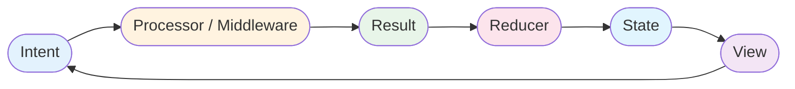
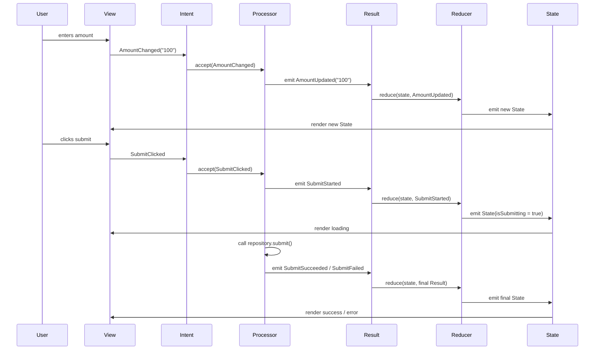
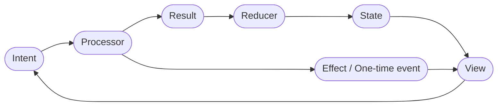
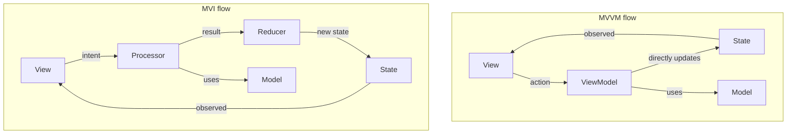

# MVI

DAY 15-21: MVI Pattern

Goal: Learn unidirectional data flow and reducer-style state updates.

## 1. MVI Mental Model

MVI (Model-View-Intent) structures a screen as a single, closed loop. Every user or system input becomes an **Intent**, the system turns that into a **Result**, a pure **Reducer** combines the previous state with the result to produce a new **State**, and the **View** renders that state. The loop then waits for the next input.



**Intent:**
- What the user or system wants to do.
- Examples: `AmountChanged`, `SubmitClicked`, `RefreshRequested`.
- A simple data object; no logic inside.

**Processor / Middleware:**
- Accepts an intent and decides what to do.
- Runs side effects (network, database, navigation).
- Emits a `Result`.

**Result:**
- A fact that happened in response to an intent.
- Examples: `AmountUpdated`, `SubmitStarted`, `SubmitFailed`.
- Results are immutable and serializable-friendly.

**Reducer:**
- Pure function: `(State, Result) -> State`.
- No side effects, no async, no Android dependencies.
- Makes state transitions predictable and easy to unit test.

**State:**
- Single immutable screen model.
- Everything the UI needs to render is inside one object.
- This eliminates partial-state bugs.

**Why teams use MVI:**
- Predictable state transitions.
- Easier debugging: every change has a source intent and result.
- Works well with Compose and immutable state.
- Reducers are trivial to test.

## 2. Intent -> Result -> State -> View

The sequence below shows the MVI loop in action. Notice how the reducer is always the one place where state changes.



````kotlin
data class TransferState(
    val amount: String = "",
    val recipient: String = "",
    val isSubmitting: Boolean = false,
    val error: String? = null,
    val canSubmit: Boolean = false
)

sealed class TransferIntent {
    data class AmountChanged(val amount: String) : TransferIntent()
    data class RecipientChanged(val recipient: String) : TransferIntent()
    object SubmitClicked : TransferIntent()
}

sealed class TransferResult {
    data class AmountUpdated(val amount: String) : TransferResult()
    data class RecipientUpdated(val recipient: String) : TransferResult()
    object SubmitStarted : TransferResult()
    object SubmitSucceeded : TransferResult()
    data class SubmitFailed(val message: String) : TransferResult()
}

fun reduce(state: TransferState, result: TransferResult): TransferState {
    val next = when (result) {
        is TransferResult.AmountUpdated -> state.copy(amount = result.amount, error = null)
        is TransferResult.RecipientUpdated -> state.copy(recipient = result.recipient, error = null)
        TransferResult.SubmitStarted -> state.copy(isSubmitting = true, error = null)
        TransferResult.SubmitSucceeded -> state.copy(isSubmitting = false)
        is TransferResult.SubmitFailed -> state.copy(isSubmitting = false, error = result.message)
    }
    return next.copy(
        canSubmit = next.amount.isNotBlank() &&
                    next.recipient.isNotBlank() &&
                    !next.isSubmitting
    )
}

class TransferViewModel(private val repository: TransferRepository) : ViewModel() {
    private val _state = MutableStateFlow(TransferState())
    val state: StateFlow<TransferState> = _state.asStateFlow()

    fun accept(intent: TransferIntent) {
        when (intent) {
            is TransferIntent.AmountChanged ->
                dispatch(TransferResult.AmountUpdated(intent.amount))
            is TransferIntent.RecipientChanged ->
                dispatch(TransferResult.RecipientUpdated(intent.recipient))
            TransferIntent.SubmitClicked -> submit()
        }
    }

    private fun dispatch(result: TransferResult) {
        _state.value = reduce(_state.value, result)
    }

    private fun submit() {
        viewModelScope.launch {
            dispatch(TransferResult.SubmitStarted)
            try {
                repository.submit(_state.value.amount, _state.value.recipient)
                dispatch(TransferResult.SubmitSucceeded)
            } catch (e: Exception) {
                dispatch(TransferResult.SubmitFailed(e.message ?: "Transfer failed"))
            }
        }
    }
}
````

## 3. Reducer as a Pure Function

The reducer is the heart of MVI. Because it is pure, it has these properties:
- Same input always produces the same output.
- No `ViewModel`, no `Context`, no `Repository` access.
- Can be tested with plain unit tests.
- Can be composed, cached, or time-travel debugged if needed.

A good reducer does not branch on business rules that belong to the domain layer. It focuses on *how a result updates the UI state*.

## 4. Side Effects and One-Time Events in MVI

One-time events such as navigation, snackbars, or toasts still need to be emitted exactly once, even in MVI. There are two common approaches.

**Option A: Include a side-effect channel/stream alongside the state.**



The processor emits both a `Result` (for the reducer) and an `Effect` (for the UI). This is the cleanest option and mirrors MVVM's `State` + `Effect` split.

**Option B: Model effects as part of state and consume them.**

Some frameworks add a `pendingEffect` field to the state, which the UI observes, consumes, and clears. This keeps everything in one state object but adds more reducer complexity. It is generally less common on Android.

## 5. When to Use MVI

Use MVI when:
- The screen has many interdependent state transitions (forms, wizards, multi-step flows).
- You need a strict, auditable state history (debugging, analytics, replay).
- Multiple inputs can trigger the same state change, and you want a single reducer to own it.
- The team values pure functions and testability over minimal boilerplate.

MVI is heavier than plain MVVM for simple screens. Start with MVVM; reach for MVI when state complexity makes direct updates hard to reason about.

## 6. MVVM vs MVI

Both patterns separate UI from business logic. The key difference is *how* state changes are authorized and expressed.



| Topic | MVVM | MVI |
|---|---|---|
| **State shape** | One or more `StateFlow` objects. Often one state class plus effects. | Single immutable state class. |
| **How state changes** | ViewModel methods update state directly. | Processor emits a `Result`, reducer returns a new state. |
| **Pure functions** | Optional; reducers are not required. | Core; the reducer is always pure. |
| **Boilerplate** | Lower. | Higher because of intents, results, and reducer. |
| **Testability** | Good when state is small and methods are isolated. | Excellent; reducer tests are pure function tests. |
| **One-time events** | `SharedFlow` / `Channel` effects. | `SharedFlow` / `Channel` effects, or modeled inside state. |
| **Best for** | Typical CRUD, detail, list, and simple screens. | Complex multi-step screens, forms, or flows with rich state transitions. |
| **Scalability** | Scales well when combined with use cases. | Scales well when state history and predictable transitions matter. |
| **Common pitfall** | Direct state updates can become scattered. | Excessive boilerplate for simple screens. |

**Interview answer:**
Choose MVVM for straightforward screens because it is simpler and less ceremonial. Use MVI when explicit state transitions and a single source of truth for state changes reduce complexity.

## 7. Testing Reducers

Reducers are pure functions, so tests are simple and fast. You do not need a `ViewModel`, a `CoroutineScope`, or a real repository.

````kotlin
@Test
fun amountUpdated_enablesSubmitWhenRecipientExists() {
    val initial = TransferState(recipient = "Alice")
    val next = reduce(initial, TransferResult.AmountUpdated("100"))
    assertTrue(next.canSubmit)
}

@Test
fun submitStarted_disablesSubmitAndClearsError() {
    val initial = TransferState(amount = "100", recipient = "Alice", canSubmit = true, error = "old error")
    val next = reduce(initial, TransferResult.SubmitStarted)
    assertFalse(next.canSubmit)
    assertTrue(next.isSubmitting)
    assertNull(next.error)
}

@Test
fun submitFailed_restoresSubmitButton() {
    val initial = TransferState(amount = "100", recipient = "Alice", isSubmitting = true)
    val next = reduce(initial, TransferResult.SubmitFailed("Network error"))
    assertFalse(next.isSubmitting)
    assertTrue(next.canSubmit)
    assertEquals("Network error", next.error)
}
````

## Interview Questions

Q: What is unidirectional data flow?
A: Data moves in one direction: actions/intents enter the ViewModel/processor, a result is produced, the reducer creates a new state, the UI renders the state, and new user input starts the loop again.

Q: What is a reducer?
A: A pure function that receives the previous state plus a result/action and returns the next state. It must not perform side effects or read external mutable state.

Q: Why is the single state object useful?
A: It guarantees the UI is always consistent. There is no risk of two unrelated state fields being out of sync with each other.

Q: What are the trade-offs between MVVM and MVI?
A: MVVM is simpler and less boilerplate but can scatter state updates. MVI is more explicit and testable but adds intent/result/reducer ceremony.

Q: How do you emit one-time effects in MVI?
A: Use a separate `SharedFlow`/`Channel` for effects, or include a `pendingEffect` field in the state that the UI consumes and clears.

For the MVVM side of this comparison, see [01_MVVM.md](01_MVVM.md).

Stubs

````kotlin
interface TransferRepository { suspend fun submit(amount: String, recipient: String) }
open class ViewModel { val viewModelScope = CoroutineScope(Dispatchers.Main) }
````
